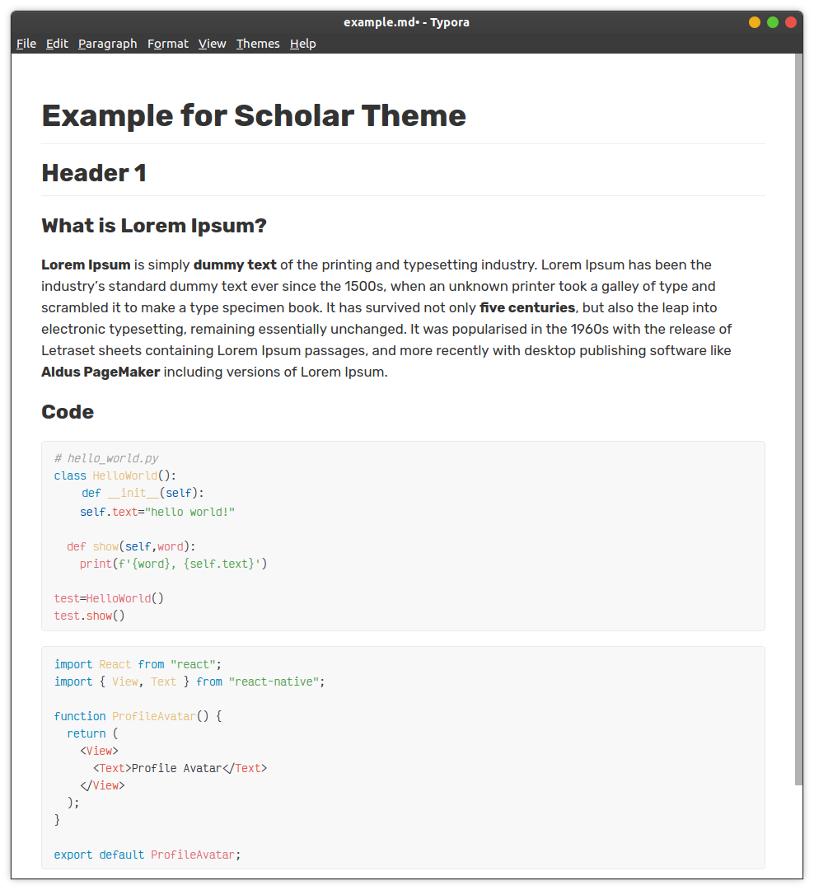

# Scholar Theme

A simple improved Github theme for Typora.

## Features

- Based on Github theme
- One Light Syntax Highlighting for code blocks
- Rubik Font
- Victor Mono Font for code blocks

## Install

### Linux

- ```bash
  wget -qO- https://github.com/bensengupta/typora-theme-scholar/zipball/master | tar xvz - -C ~/.config/Typora/themes
  ```
- Select `Scholar` theme in Typora.

### Manual

- Download the theme package.
- Extract all the file under `theme` folder to Typora's theme folder.
- Select `Scholar` theme in Typora.

## Screenshots

### Scholar Theme



### Github Theme


## Notes

- Only tested on Linux, Typora version 0.9.89(beta).

## Credits

- This README is adapted from [sweatran's One Dark theme](https://github.com/sweatran/typora-onedark-theme) repo.

> Pull requests are welcome. If you have any advice or feedback, please create a new issue or contact me via email: benjamin.sengupta@gmail.com
