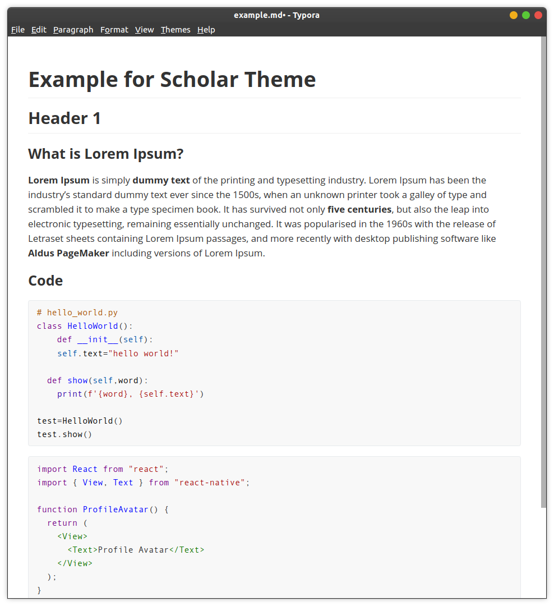

# Scholar Theme

A simple improved Github theme for Typora.

## Features

- Based on Github theme
- One Light Syntax Highlighting for code blocks
- Rubik Font
- Victor Mono Font for code blocks

## Install

- [Download](https://github.com/bensengupta/typora-theme-scholar/zipball/master) the theme package.
- Extract all the file under `theme` folder to Typora's theme folder (File > Preferences > Appearance > Open Theme Folder).
- Restart Typora.
- Select `Scholar` theme in Typora.

or with curl

```bash
curl -L https://github.com/bensengupta/typora-theme-scholar/releases/download/v1.0/typora-theme-scholar.tar.xz | tar xJ -C ~/.config/Typora/themes
```

## Comparaison

### Scholar Theme


### Github Theme



## Credits

> Pull requests are welcome. If you have any advice or feedback, please create a new issue or contact me via email: benjamin.sengupta@gmail.com
